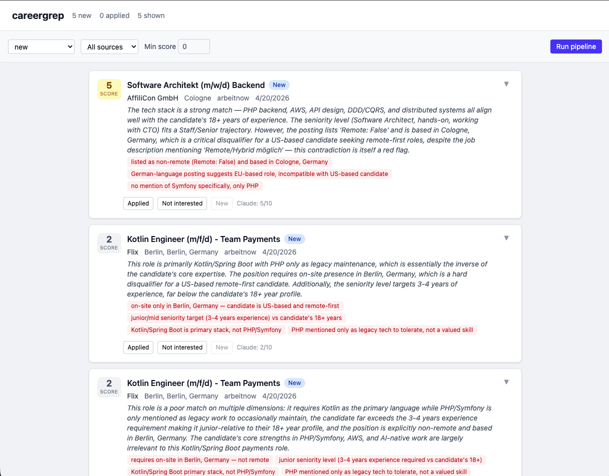

# careergrep

A personal job search tool that surfaces genuinely fresh (last 24h) tech job postings from multiple ATS sources and discovery aggregators, scores them against your profile by keyword, and delivers a daily email digest.

Built as both a practical tool for an active job search and a portfolio project demonstrating Python, FastAPI, TypeScript/React, and AI-native development.

## Screenshots



## Tech Stack

- **Backend:** Python 3.12+, Pydantic, SQLite, httpx, Anthropic SDK
- **Data Sources:** Greenhouse, Ashby, Workable, Lever (watch list) + Arbeitnow (discovery)

## Getting Started

```bash
# Clone the repo
git clone https://github.com/paedda/careergrep.git
cd careergrep

# Set up Python environment
uv sync

# Copy and configure environment variables
cp .env.example .env
# Edit .env with your ANTHROPIC_API_KEY, SMTP_USER, SMTP_PASSWORD

# Copy and configure your preferences
cp config.yaml.example config.yaml  # (or edit config.yaml directly)

# Run the pipeline
uv run careergrep fetch
```

## Usage

### Fetch new jobs

```bash
# Normal daily run — fetches, scores, sends email digest
uv run careergrep fetch

# Skip email, print results to terminal
uv run careergrep fetch --no-email

# Show location, posted date, and description snippet
uv run careergrep fetch --no-email --verbose

# Widen the time window (useful on weekends or for testing)
uv run careergrep fetch --no-email --max-age 72

# Fetch without marking jobs as seen (safe for testing)
uv run careergrep fetch --no-email --no-mark-seen

# Show more than the default 10 results
uv run careergrep fetch --no-email --limit 25
```

### Browse stored jobs

```bash
# List new jobs already in the DB
uv run careergrep list

# Show with details (location, date, description snippet)
uv run careergrep list --verbose

# Filter by status: new, seen, applied, not_interested
uv run careergrep list --status seen

# Show all jobs regardless of status
uv run careergrep list --all-statuses
```

## Configuration

Edit `config.yaml` to set your profile, discovery preferences, and keyword filters:

```yaml
user:
  name: Your Name
  profile_summary: |
    Senior Backend Engineer, PHP/Symfony, AWS...

keywords:
  must_have_any: [PHP, Senior, Backend]
  nice_to_have: [Remote, AI, AWS]
  exclude: [Junior, Intern]

# Discovery: keyword-based search across aggregators (no company list needed)
discovery:
  enabled: true
  sources:
    - arbeitnow   # Remote jobs worldwide

# Optional watch list: specific companies to always monitor
companies:
  greenhouse: [anthropic, stripe]
  ashby: [linear]
  workable: []
  lever: []
```

Secrets go in `.env` only — never in `config.yaml`:

```
ANTHROPIC_API_KEY=sk-ant-...
SMTP_USER=you@gmail.com
SMTP_PASSWORD=your-app-password
```

## Project Status

Under active development. See [PLAN.md](PLAN.md) for the full roadmap.

- [x] Phase 0 — Project setup
- [x] Phase 1 — Greenhouse fetch + keyword scoring + email digest
- [x] Phase 2 — Multi-source (Ashby, Workable, Lever, Arbeitnow) + SQLite + dedup + discovery
- [x] Phase 3 — Claude scoring
- [ ] Phase 4 — FastAPI + React/TS frontend
- [ ] Phase 5 — Scheduling + polish
- [ ] Phase 6 — Deployment

## Author

**Peter Kallai** - [peterkallai.com](https://peterkallai.com) | [GitHub](https://github.com/paedda)
